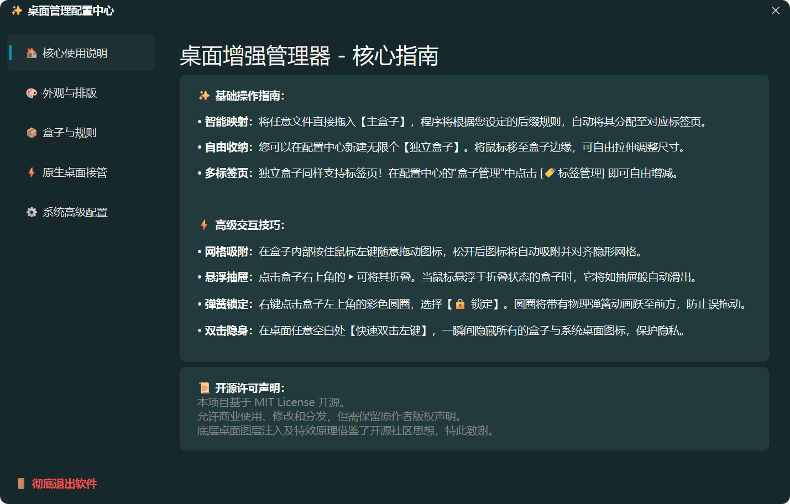
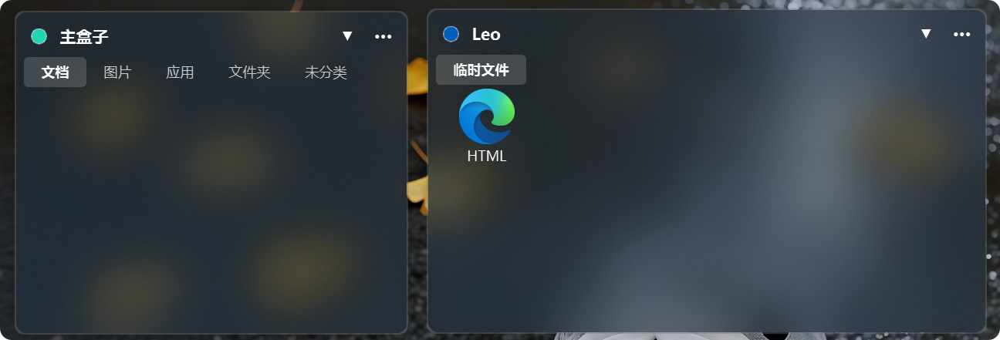
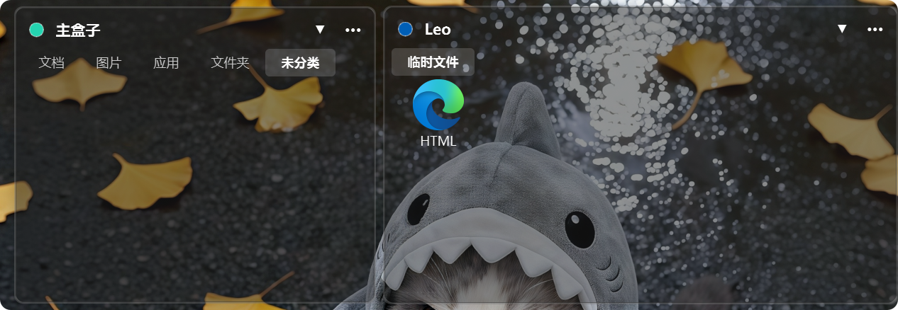

# ✨ BoxIN

一个基于 Python (PySide6) 和 Windows底层API 开发的现代化桌面增强整理工具。采用原生 Fluent Design 语言，提供类似 Fences 的高级体验，且更轻量、更灵活。

## 🌟 核心特性

- **🚀 零侵入桌面接管**：安全映射桌面文件到主分类盒子中，支持隐藏底层原生系统桌面，但不移动任何物理文件，保证数据绝对安全！同样的，这个程序也只有映射模式一种模式。
- **🎨 Fluent Design 多彩主题**：提供 10+ 种全局设置皮肤与盒子背景色，支持 Win11 原生**亚克力(Acrylic)** 和**毛玻璃(Blur)** 材质特效。
- **📦 智能折叠与吸附引擎**：
  - 盒子内部图标自由拖拽，自动**对齐网格吸附**。
  - 支持鼠标悬浮**智能折叠/展开**，标签页鼠标划过自动切换。
- **🔒 动画魔法**：独创“弹簧圆圈”锁定机制，点击快速为盒子加锁防误触。
- **🏷️ 高级标签页**：每个独立盒子均可创建无限数量的专属子标签页，支持设置中心可视化增删改名。
- **👀 双击隐身**：双击桌面空白处，一键隐藏/显示系统内所有的原生图标和盒子！


## 🛠️ 安装与运行

确保您的系统安装了 **Python 3.10+**，并安装依赖：

```bash
pip install PySide6 pynput pywin32
```
运行：
```bash
python main.py
```
打包：
```bash
python -m venv build_env

build_env\Scripts\activate

pip install PySide6 pynput pywin32 nuitka zstandard

python -m nuitka --standalone --windows-disable-console --windows-icon-from-ico=logo.ico --include-data-file=logo.ico=logo.ico --enable-plugin=pyside6 --include-qt-plugins=platforms,styles --follow-imports --remove-output --output-dir=build_out main.py
```
---
### * 已发布1.0版本，解压后，运行文件内的BoxIn.exe即可。
---

### 🌐多语言支持

支持CN EN JP，相关翻译在i18n.py内配置。

### 应用内展示

* 配置中心



* 盒子亚克力效果



* 盒子透明效果



---

### 📐 操作说明
拖拽映射：把任何文件从资源管理器拖入盒子即可完成映射。
边缘拉伸：鼠标移动到盒子无边框边缘即可拉伸调整大小。
右键管理：在盒子的右上角 ... 或圆圈处右击，即可调出高度定制的排序、修改大小、修改颜色菜单。
后台静默：关闭设置中心会自动隐藏到系统托盘，右键托盘图标可彻底退出并恢复桌面。
### 📜 许可说明
本项目基于 MIT License 开源。
允许商用、修改和分发，但请保留作者声明。感谢开源社区中关于桌面图层获取灵感的分享。
